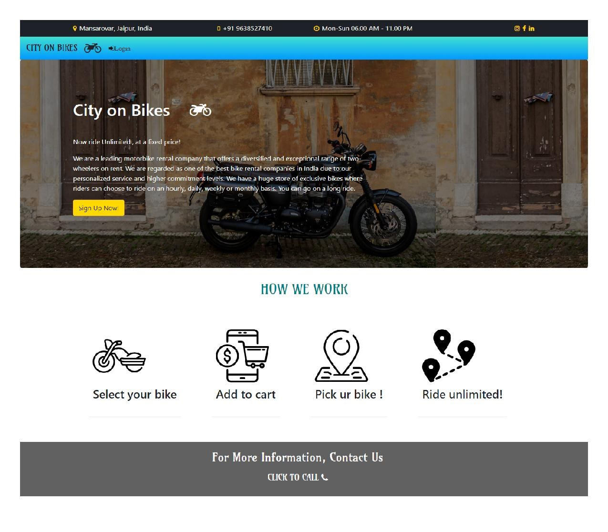
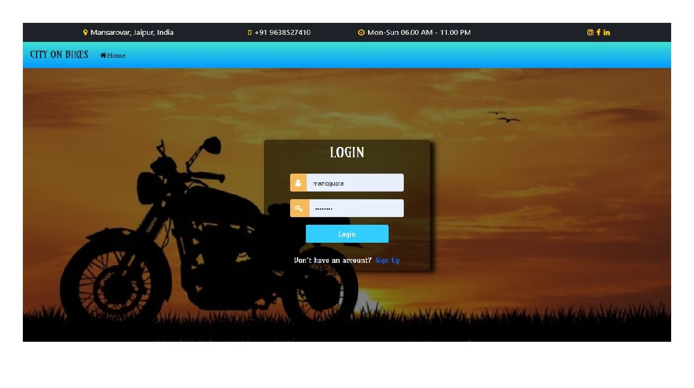
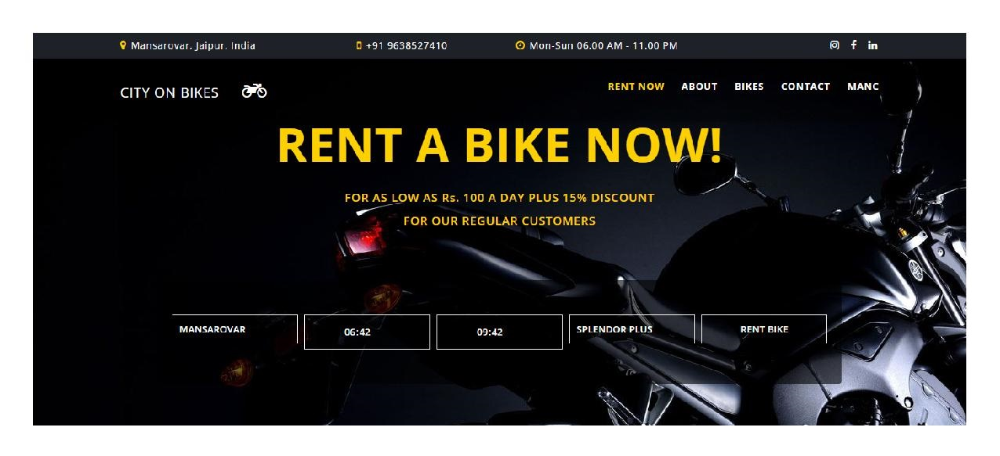
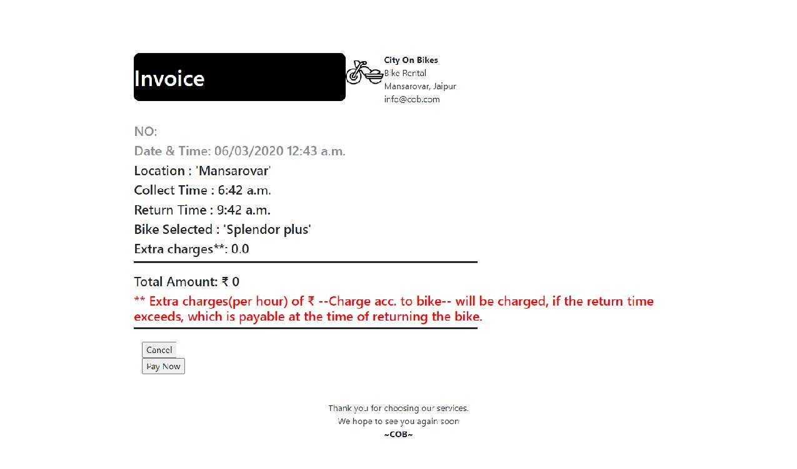
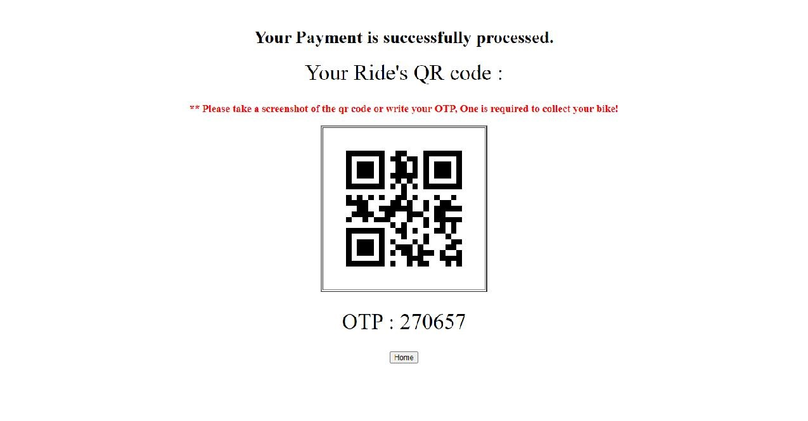

# City On Bikes
This repository contains the implementation of project City on Bikes .

# Aim :
To build a website where people can rent the bikes available at the nearest hub . 

#Prerequisites :

1) 64-bit Python 3.6 installation .
2) Django must be installed .
3) Python libraries Qrcode and random must be already present.

 # Setting Up Front end :
 
 1) Add a home page with a link to the Login and Signup .
 
 2) Add the sign up and Login pages .
 
 3) Create a model for user details .
 4) The model will save the details of the user .
 
 # Layout and Basic Styling
 
 Create our header and footer partials
 Add in Bootstrap
  
 #Style the Navbar and Form
 
 Add a navbar to all templates
 Style the form
 
 # Create templates
 
 Create the About template 
 
 Create the Contact template 
 
 Attach a modal displaying the bikes available to the navbar.
 
 # Book now
 Create a template that has a form that takes in the choice of the customer about bikes and time .
 Save that in the database .
 
 
 #Authentication in views.py
 
 Create the views for all the html files for rendering it.
 Authenticate the user login and save in database for further use.
 
#Auth Pt. 1 - Add User Model
Install all packages needed for auth

Define User model

#Auth Pt. 2 - Register
Save the data to django admin database

Add register routes

Add register template

#Auth Pt. 3 - Login
Add login routes

Add login template

#Auth Pt. 4 - Logout/Navbar
Add logout route

Add links to navbar

#Auth Pt. 5 - Show/Hide Links
Show/hide auth links in navbar
 
#Bike model 
 
 Create a bike model that has the information about bikes 
 
# Invoice 
 
 generate an invoice of the data entered by the user and also generate the charge of the rent
 
 
# Qrcode 

 Generate Qrcode and otp using the random library and qrcode generator.
 
 
 Create a superuser for admin power
 
 

